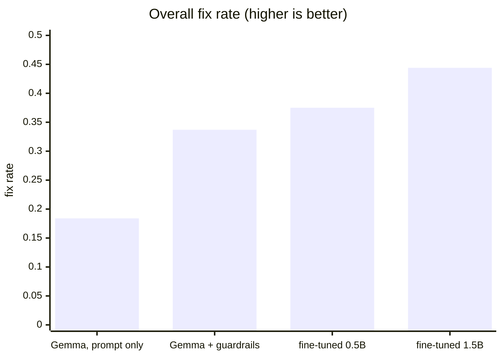
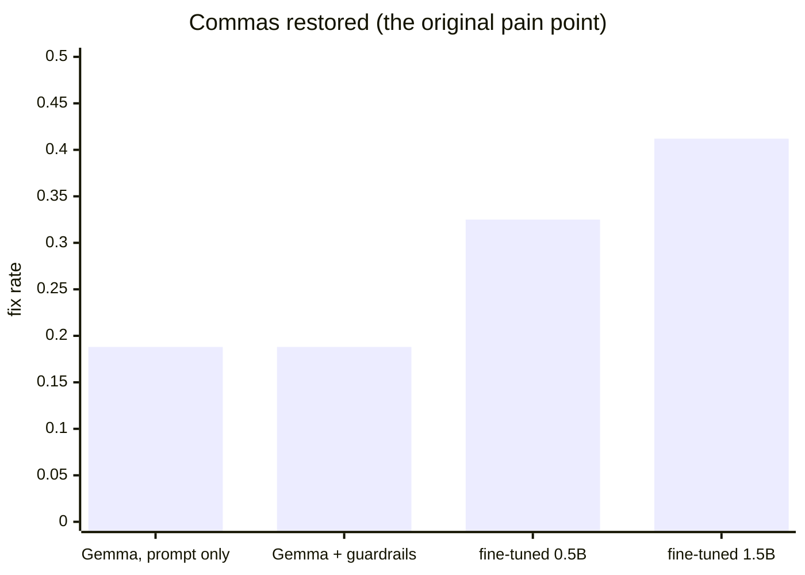

# Results: product + experiments

Every number below comes from the same benchmark: **403 test cases built from my
own Telegram messages** (Russian, Ukrainian, English, some German), split into
five buckets. A case counts as fixed only when the model output matches what I
actually wrote and sent - so the target is my real writing style, not textbook
grammar. The harness lives in `eval/`.

## 🎯 The short version

I started with a stock 4.2 GB model and a prompt. I ended with a **1 GB model
fine-tuned on my own chat history that beats it on every metric** - twice as
good on commas, faster, and no worse at leaving my slang alone.

| | Gemma 4 E2B, prompt only | Gemma 4 E2B + guardrails (v7.3) | Qwen2.5-0.5B fine-tuned | Qwen2.5-1.5B fine-tuned |
| --- | --- | --- | --- | --- |
| Size on disk (Q4_K_M) | 4.2 GB | 4.2 GB | 0.4 GB | **1.0 GB** |
| Overall fix rate | 0.184 | 0.337 | 0.375 | **0.444** |
| Style damage, hard* | - | 0.155 | 0.190 | **0.155** |
| Commas restored | 0.188 | 0.188 | 0.325 | **0.412** |
| Typos fixed | 0.273 | 0.306 | 0.273 | **0.413** |
| Wrong keyboard layout fixed** | 0.000 | 0.600 | 0.650 | 0.550 |
| Median latency (RTX 4060 Ti, warm) | 0.15 s | 0.15 s | 0.05 s | **0.09 s** |

\* Hard style damage = word-level changes to messages that should stay
untouched (slang, stretched letters, names). Punctuation- and case-only edits
are not counted - adding a missing comma to a slangy message is a fix, not
damage. This is the number I refused to let get worse.

\*\* The layout bucket is mostly solved by a deterministic pre-pass
(`gen_layout.py`), not by the model - the baseline model alone scores 0 here.

## At a glance

## 🚢 The ship rule

Decided before training, so I could not move the goalposts afterwards: a
fine-tune replaces Gemma only if it **beats 0.337 overall AND keeps hard style
damage at or below 0.155**.

- **0.5B: rejected.** Fix rate passed (0.375), style damage failed (0.190).
  Below some size the model starts inventing damage instead of just missing
  fixes: it turned "let's gooo" into "let's gooork" and mangled stretched
  names. That failure mode is disqualifying for a tool that rewrites your
  text in place - and finding the exact size floor was the point of trying.
- **1.5B: shipped.** Better than the 4.2 GB baseline everywhere, equal on
  style damage, 4x smaller.

## 🏭 How the training data was made

No manual labeling. A script (`train/build_dataset.py`) took ~89,000 of my own
sent messages and manufactured ~55,000 training pairs: my real message is the
*target*, and programmatic damage to it (keyboard-neighbor typos, stripped
commas, both) is the *input*. Comma-restoration pairs are built only from
messages where I genuinely wrote the commas myself. A big no-op slice teaches
the model that most messages need no change at all. Training: QLoRA, one
epoch, single RTX 4060 Ti, about an hour for the 0.5B and a few hours for the
1.5B.

## ⚖️ Honest limitations

- This is an n=1 benchmark by design: it measures *my* style, on *my*
  hardware. Your numbers will differ - which is why the repo ships the
  pipeline, not my model.
- The comma metric is strict (exact positions), so the absolute numbers look
  low; the *relative* jump 0.188 -> 0.412 is the signal.
- My own labels are imperfect - I skip commas when lazy, so a small share of
  targets is noisy. The measured gains survive that noise.
- The fine-tuned weights are not published: models trained on private chats
can memorize and leak them verbatim.
